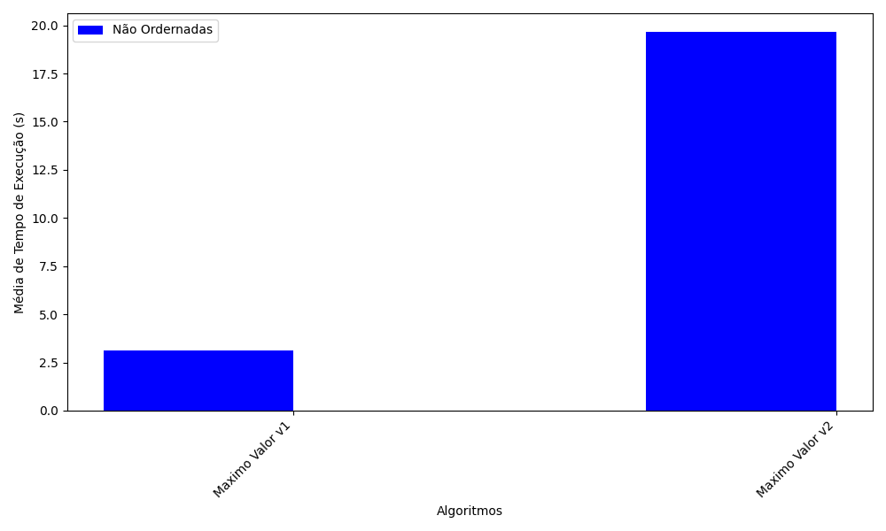
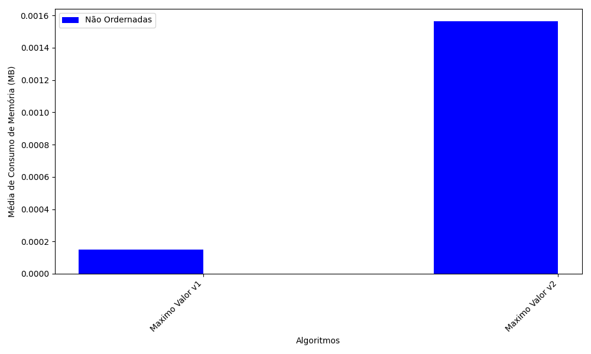

    

    
    <h4>
        UNIVERSIDADE FEDERAL DO CEARÁ – CAMPUS SOBRAL
    </h4>
    <h4>
       CURSO DE ENGENHARIA DA COMPUTAÇÃO
    </h4>
    <h4>
       DISCIPLINA: TÓPICOS ESPECIAIS EM COMPUTAÇÃO II
    </h4>
    <h4>
       PROFESSOR: FISCHER JONATAS FERREIRA
    </h4>
       
    <h4>
        TRABALHO ESQUENTA 2
    </h4>
    <h4>
        EXPERIMENTAÇÃO DE ALGORITMOS DE BUSCA DO VALOR MÁXIMO
    </h4>
        
    

        <h4>LUCAS RODRIGUES DA SILVA - 428787   </h4>
    

        
    <h4> SOBRAL - CE </h4>
    <h4> 2023.2 </h4>

##

 

    <h2> SUMÁRIO </h2>

 

1. [INTRODUÇÃO](#intro)
2. [OBJETIVOS](#obj)
3. [MATERIAIS E MÉTODOS](#mat_met)
4. [ANÁLISE DOS ALGORITMOS](#analise)
    - 4.1. [Máximo Valor v1](#maxval1)
    - 4.2. [Máximo Valor v2](#maxval2)
    - 4.3. [Resumo Geral dos Experimentos - Tabelas](#res_tab)
    - 4.4. [Resumo Geral dos Experimentos - Gráficos](#res_geral_graf)
5. [CONCLUSÃO](#5-conclusão)
5. [REFERÊNCIAS BIBLIOGRÁFICAS ](#6-referências-bibliográficas)

## 1. INTRODUÇÃO

&nbsp; Uma lista é uma estrutura de dados que armazena um conjunto de elementos que podem ser números, strings, objetos ou outros tipos de dados <a href='#ref'> [1] </a>. Cada elemento da lista possui uma posição (índice), indo de 0 à n - 1.

&nbsp; Um algoritmo de busca é um conjunto de instruções para pesquisar um item específico em uma lista ou verificar se esse item existe na lista <a href='#ref'> [2] </a>. Existem diferentes tipos de algoritmos de busca, dependendo da organização da lista e dos critérios de comparação entre os itens.

&nbsp;  Um algoritmo de pesquisa máxima de lista é um tipo especial de algoritmo de pesquisa que retorna o maior elemento de uma lista, ou seja, um elemento que é maior que todos os outros elementos <a href='#ref'> [3] </a>. Esse tipo de algoritmo ajuda a resolver problemas como determinar o maior salário de uma empresa, o maior número de votos em uma eleição, entre outros.

&nbsp;  Existem várias maneiras de implementar algoritmos de busca de valor máximo em listas. No entanto, a ideia básica é percorrer a lista e comparar cada elemento com um valor inicial que representa o maior elemento encontrado até o momento. Se o elemento atual for maior que o valor inicial, ele se tornará o novo valor máximo. O valor mais alto no final da lista é o resultado do algoritmo <a href='#ref'> [4] </a>.

## 2. OBJETIVOS DO EXPERIMENTO

- Comparar o desempenho dos algoritmos em termos de tempo de execução e consumo de memória;
- Analisar o comportamento dos algoritmos em diferentes cenários, como listas de tamanhos variados e; 
- Investigar possíveis melhorias nos algoritmos estudados.

## 3. MATERIAIS E MÉTODOS

&nbsp; Para a realização do experimento proposto, utilizou-se a linguagem de programação Python, por ter uma extensa gama de bibliotecas e ser voltada para análise de dados, o que permite a utilização de uma grande quantidade de dados, além da sua versatilidade e facilidade de uso. As configurações da máquina que rodou os experimentos está listada na tabela 1.

 

<h4 align='center'>Tabela 1: Configurações da Máquina Utilizada </h4>

<table align='center'>
    <thead>
        <tr>
            <th style="text-align:center"><strong>PROCESSADOR</strong></th>
            <th style="text-align:center"><strong>QTD MEMÓRIA RAM</strong></th>
            <th style="text-align:center"><strong>GPU</strong></th>
        </tr>
    </thead>
    <tbody>
        <tr>
            <td style="text-align:center">AMD Ryzen 7 3700U</td>
            <td style="text-align:center">12 GB</td>
            <td style="text-align:center">Integrada - RX Vega 10</td>
        </tr>
    </tbody>
    <tfoot>
        <tr>
            <td style='font-size: 11px;'  colspan='3'>Fonte: Próprio autor.</td>
        </tr>
  </tfoot>
</table>

&nbsp; Para calcular o tempo de execução utilizou-se o módulo time. Já para calcular o consumo de memória utilizou-se o módulo tracemalloc, igualmente utilizado no <a href="https://github.com/LucasRodriguesdaSilva/trab1-analise-alg-busca"> relatório 1</a>.

&nbsp; Neste trabalho, utilzou-se somente as listas não ordenadas, com 10 iterações para cada instância.

## 4. ANÁLISE DOS ALGORITMOS

&nbsp; Para esta análise, foram utilizando os seguintes algoritmos:

- Máximo Valor v1;
- Máximo Valor V2;

&nbsp; Juntamente com treze listas não ordenadas de dados, variando seu tamanho.

### 4.1. Máximo Valor v1

&nbsp; O primeiro algoritmo experimentado foi a busca para encontrar o valor máximo de uma lista na sua versão 1, onde este algoritmo percorre todos os elementos de um array, comparando cada elemento com o valor máximo encontrado até o momento e atualizando o valor máximo sempre que um elemento maior é encontrado. Assim retornando o maior valor encontrado no array.

&nbsp; Para o experimento, foi utilizado 10 iterações para cada instância.

&nbsp; As figuras 1 e 2 mostram as médias dos tempos de execução e consumo de memória para cada lista utilizada.

<table align='center'>
    <thead>
        <tr >
            <th style='text-align: center;'>Figura 1: Tempo de Execução (s)</th>
            <th style='text-align: center;'>Figura 2: Consumo de Memória (MB)</th>
        </tr>
    </thead>
    <tbody>
        <tr>
            <td>
                
            </td>
            <td>
                
            </td>
        </tr>
    </tbody>
    <tfoot>
        <tr>
            <td style='font-size: 11px;'  colspan='2'>Fonte: Próprio autor.</td>
        </tr>
    </tfoot>
</table>

&nbsp; Para o consumo de memória, pode-se notar, até a segunda instância, um pico de consumo constante, mas entre a segunda e a terceira instância a um salto do consumo, que depois é estabilizado até a última lista. Isso pode ter ocorrido por conta da variação do tamanho das lista 2 e 3, onde a segunda lista contém duzentos elementos e a terceira contém mil elementos, fazendo assim, essa variação brusca.

&nbsp; Já para o tempo de execução, pode-se notar que da primeira à décima instância, o tempo é quase constante, tendo poucas varições. Mas a partir da décima, o tempo de execução do algoritmo é bastante perceptível, chegando a uma média de 35 segundos.

### 4.2. Máximo Valor v2

&nbsp; O segundo algoritmo experimentado foi a busca para encontrar o valor máximo de uma lista na sua versão 2, onde este algoritmo divide repetidamente o intervalo em subintervalos menores, chamando a si mesmo recursivamente para encontrar o valor máximo em cada subintervalo. Ele então combina os valores máximos encontrados nos subintervalos para determinar o valor máximo no intervalo original. Isso é feito de maneira eficiente, explorando a estrutura de divisão e conquista.

&nbsp; As figuras 3 e 4 mostram as médias dos tempos de execução e consumo de memória para cada lista utilizada.

<table align='center'>
    <thead>
        <tr >
            <th style='text-align: center;'>Figura 3: Tempo de Execução (s)</th>
            <th style='text-align: center;'>Figura 4: Consumo de Memória (MB)</th>
        </tr>
    </thead>
    <tbody>
        <tr>
            <td>
                
            </td>
            <td>
                
            </td>
        </tr>
    </tbody>
    <tfoot>
        <tr>
            <td style='font-size: 11px;'  colspan='2'>Fonte: Próprio autor.</td>
        </tr>
    </tfoot>
</table>

&nbsp; Pode-se notar, ao observar a figura 3, que os tempos médios de execução até a décima instância é semelhante ao algoritmo na versão 1, mas a apartir da décima o tempo de execução aumenta consideravelmente, chegando a ser maior que 3 minutos para concluir a execução. Isso pode acontecer por diversos fatores, um deles pode ser a lista não ordenada, deixando a procura mais difícil.

&nbsp; Já o consumo de memória, figura 4, aumenta com o tamanho das listas, isso ocorre por conta da recursividade, deixando o algoritmo na versão 2, menos eficiente do que a versão 1.

### 4.3. Resumo Geral dos Experimentos - Tabelas

#### Tabela 02: Média Geral do Tempo Gasto

**Algoritmos**       | **Instância $100$ (s)** | **Instância $200$ (s)** | **Instância $1*10^3$ (s)** | **Instância $2*10^3$ (s)** | **Instância $5*10^3$ (s)** | **Instância $1*10^4$ (s)** | **Instância $5*10^4$ (s)** | **Instância $1*10^5$ (s)** | **Instância $5*10^5$ (s)** | **Instância $1*10^6$ (s)** | **Instância $5*10^6$ (s)** | **Instância $1*10^7$ (s)** | **Instância $1*10^8$ (s)** 
:--------------------:|:--------------------------:|:--------------------:|:---------------------:|:--------:|:--------:|:--------:|:--------:|:--------:|:--------:|:--------:|:--------:|:--------:|:--------:
**Máximo Valor v1**|0.0 | 0.0| 0.0| 0.0| 0.0| 0.0015 | 0.0212 | 0.0319 | 0.1758 | 0.3350 | 1.9073 | 3.9166 | 33.9667
**Máximo Valor v2**| 0.0| 0.0 | 0.0005 | 0.0005 | 0.0100 | 0.0157 | 0.0912 | 0.2023 | 0.8690 | 1.6930| 7.6000| 19.8663| 225.0155
###### Fonte: Próprio autor.

#### Tabela 03: Média Geral do Consumo da Memória Gasta
 

**Algoritmos**       | **Instância $100$ (s)** | **Instância $200$ (s)** | **Instância $1*10^3$ (s)** | **Instância $2*10^3$ (s)** | **Instância $5*10^3$ (s)** | **Instância $1*10^4$ (s)** | **Instância $5*10^4$ (s)** | **Instância $1*10^5$ (s)** | **Instância $5*10^5$ (s)** | **Instância $1*10^6$ (s)** | **Instância $5*10^6$ (s)** | **Instância $1*10^7$ (s)** | **Instância $1*10^8$ (s)** 
:--------------------:|:--------------------------:|:--------------------:|:---------------------:|:--------:|:--------:|:--------:|:--------:|:--------:|:--------:|:--------:|:--------:|:--------:|:--------:
**Máximo Valor v1**| 0.0001 | 0.0001| 0.0001 | 0.0001 | 0.0001 | 0.0001 | 0.0001 | 0.0001 | 0.0001 | 0.0001 | 0.0001 | 0.0001 | 0.0001 
**Máximo Valor v2**| 0.0003 | 0.0004 | 0.0010 | 0.0011 | 0.0012 | 0.0013 | 0.0016 | 0.0017 | 0.0019 | 0.0020 | 0.0022 | 0.0023 | 0.0027
###### Fonte: Próprio autor.

### 4.4. Resumo Geral dos Experimentos - Gráficos
 

&nbsp; As figuras 5 e 6 mostram o histograma dos resultados obtidos nas tabelas 2 e 3.

<table align='center'>
    <thead>
        <tr><th colspan='2'>Histograma dos Resultados Obtidos</th></tr>
        <tr >
            <th style='text-align: center;'>Figura 5: Media Geral dos Tempos de Execução</th>
            <th style='text-align: center;'>Figura 6: Media Geral dos Consumo de Memória</th>
        </tr>
    </thead>
    <tbody>
        <tr>
            <td>
                
            </td>
            <td>
                
            </td>
        </tr>
    </tbody>
    <tfoot>
        <tr>
            <td style='font-size: 11px;'  colspan='2'>Fonte: Próprio autor.</td>
        </tr>
    </tfoot>
</table>

## 5. CONCLUSÃO

&nbsp; Ao realizar a investigação dos algoritmos, e analisar os gráficos e tabelas, é possível concluir que o algoritmo de busca do valor máximo na versão 1 é mais eficiente do que na versão 2, tanto em relação ao tempo nescessário para concluir a execução, quanto em relação ao consumo de memória nescessária. 

&nbsp; Mesmo o algoritmo da versão 2, implementar a divisão e conquista, os experimentos mostraram que em uma lista não ordenada, sua eficiencia é menor do que a versão 1 e isso se deve ao fato de que a versão 1 utiliza um laço de repetição para percorrer a lista, enquanto a versão 2 utiliza uma chamada recursiva. A recursividade aumenta o consumo de memória, pois cada chamada cria um novo quadro na pilha de execução, e também pode causar uma sobrecarga no tempo de execução, pois cada chamada envolve operações adicionais, como passagem de parâmetros e retorno de valores. Portanto, a versão 1 é mais eficiente e estável do que a versão 2.

## 6. REFERÊNCIAS BIBLIOGRÁFICAS 

    [1] SILVA, J. A. Estruturas de dados. São Paulo: Editora ABC, 2019. 
     
    [2] COSTA, M. F.; SANTOS, R. L. Algoritmos e programação. Rio de Janeiro: Editora XYZ, 2020. 
     
    [3] KNUTH, D. E. The art of computer programming. Volume 3: Sorting and searching. 2. ed. Reading: Addison-Wesley, 1998.  
     
    [4] CORMEN, T. H. et al. Introduction to algorithms. 3. ed. Cambridge: MIT Press, 2009

